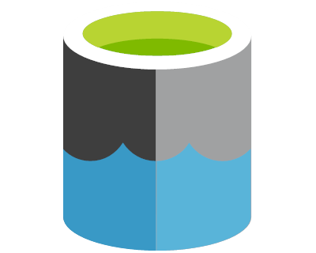

<!-- ========= HEADER ========== -->

<!-- clean gradient divider -->

<!-- typing header -->

  

<!-- BIG gradient title -->

  

  

  

<!-- ========= ABOUT ========== -->

<h3>
  
  About me
</h3>

I design and ship BI, data engineering, and applied AI systems with **Power BI**, **SQL**, **Azure**, **Python**, and **Power Platform**: semantic models, reporting pipelines, governed data layers, workflow automations, and AI-assisted document workflows.

- **Core stack:** Power BI · SQL · Azure Data Factory · ADLS Gen2 · Azure SQL · Python · Power Automate · Azure AI Foundry
- **What I build:** executive dashboards · semantic models · Azure data pipelines · reporting automation · AI-assisted document workflows
- **Applied AI tools:** Azure OpenAI · Azure AI Search · Document Intelligence · Foundry agents · RAG evaluation
- **How I work:** model the data → automate the workflow → add controls → validate quality → ship systems business teams can trust

> Focused on **BI Developer · BI Engineer · Analytics Engineering · Data Engineering · Applied AI Automation** work.

<!-- divider -->

  

<!-- ========= TECH STACK ========== -->

<h3>
  
  Technologies that I use
</h3>

<table align="center">
  <tr>
    <td align="center" width="96">
      
       Power BI
    </td>
    <td align="center" width="96"> Azure</td>
    <td align="center" width="96"> SQL Server</td>
    <td align="center" width="96"> Python</td>
    <td align="center" width="96"> ADF</td>
    <td align="center" width="96"> ADLS Gen2</td>
    <td align="center" width="96"> Azure SQL</td>
    <td align="center" width="96"> Databricks</td>
  </tr>
  <tr>
    <td align="center" width="96"> Functions</td>
    <td align="center" width="96"> Key Vault</td>
    <td align="center" width="96"> Azure OpenAI</td>
    <td align="center" width="96"> AI Search</td>
    <td align="center" width="96"> Doc Intel</td>
    <td align="center" width="96"> AI Language</td>
    <td align="center" width="96"> AI Foundry</td>
    <td align="center" width="96"> LangChain</td>
  </tr>
  <tr>
    <td align="center" width="96">
      
       Delta Lake
    </td>
    <td align="center" width="96"> Spark</td>
    <td align="center" width="96"> Airflow</td>
    <td align="center" width="96"> dbt</td>
    <td align="center" width="96"> Snowflake</td>
    <td align="center" width="96"> Pandas</td>
    <td align="center" width="96"> PostgreSQL</td>
    <td align="center" width="96"> MySQL</td>
  </tr>
  <tr>
    <td align="center" width="96">
      
       Tableau
    </td>
    <td align="center" width="96"> FastAPI</td>
    <td align="center" width="96"> Docker</td>
    <td align="center" width="96"> Git</td>
    <td align="center" width="96"> GH Actions</td>
    <td align="center" width="96"> Terraform</td>
    <td align="center" width="96"> AWS</td>
    <td align="center" width="96"> Linux</td>
  </tr>
</table>

<!-- ========= CONTACT ========== -->

  

<h3>
  
  Reach me
</h3>

  
  &nbsp;&nbsp;
  

  <svg width="100%" height="6" viewBox="0 0 1200 6" xmlns="http://www.w3.org/2000/svg">
    <rect width="1200" height="6" rx="3" fill="url(#contact-line)"/>
  </svg>

  

<!-- ========= END ========== -->
